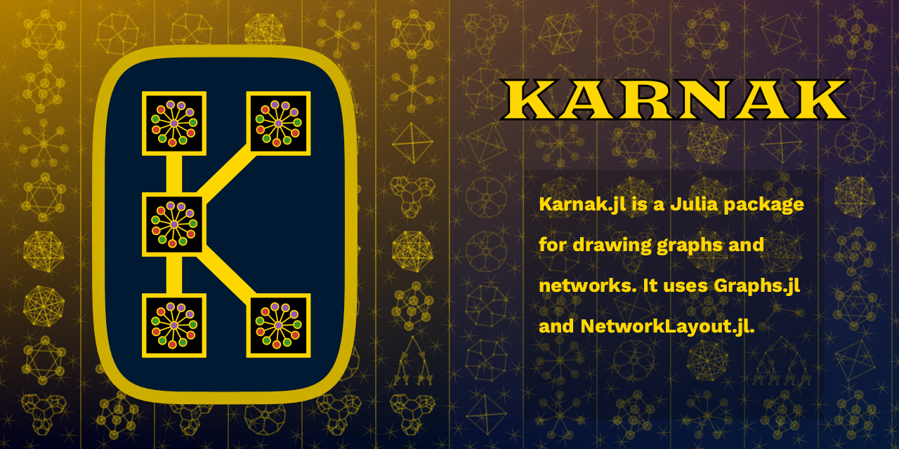

| **Documentation**                       | **Build Status**                          |
|:---------------------------------------:|:-----------------------------------------:|
| [![][docs-stable-img]][docs-stable-url] | [![Build Status][ci-img]][ci-url]         |
| [![][docs-development-img]][docs-development-url] |                                 |

Karnak.jl is a small extension for the Luxor.jl package to
help with constructing graph-style drawings.

Karnak relies on [Graphs.jl](https://juliagraphs.org/Graphs.jl/) for graph construction, and
on [NetworkLayout.jl](https://juliagraphs.org/NetworkLayout.jl/) for graph layout.

The focus in Karnak, unlike other graph visualization
packages, is on decorative and aesthetic uses, for use in
design, generative art, social media previews, NFTs, and
other mission-critical items, rather than on
scientific rigor and mathematical elegance. So...

## Warning

For scientific and technical visualization, use one of
the following Julia packages to visualize your graphs:

- [TikzGraphs.jl](https://github.com/sisl/TikzGraphs.jl): backend: Tikz/Latex

- [GraphPlot.jl](https://juliagraphs.org/GraphPlot.jl/): backend: Compose.jl

- [SGtSNEpi.jl](https://github.com/fcdimitr/SGtSNEpi.jl): backend: Makie.jl

- [GraphRecipes.jl](https://github.com/JuliaPlots/GraphRecipes.jl): backend: Plots.jl

- [GraphMakie.jl](https://github.com/JuliaPlots/GraphMakie.jl): backend: Makie.jl

rather than this one.

[docs-development-img]: https://img.shields.io/badge/docs-development-blue
[docs-development-url]: http://cormullion.github.io/Karnak.jl/dev/

[docs-stable-img]: https://img.shields.io/badge/docs-stable-blue.svg
[docs-stable-url]: http://cormullion.github.io/Karnak.jl/dev/

[ci-img]: https://github.com/cormullion/Karnak.jl/workflows/CI/badge.svg
[ci-url]: https://github.com/cormullion/Karnak.jl/actions?query=workflow%3ACI
