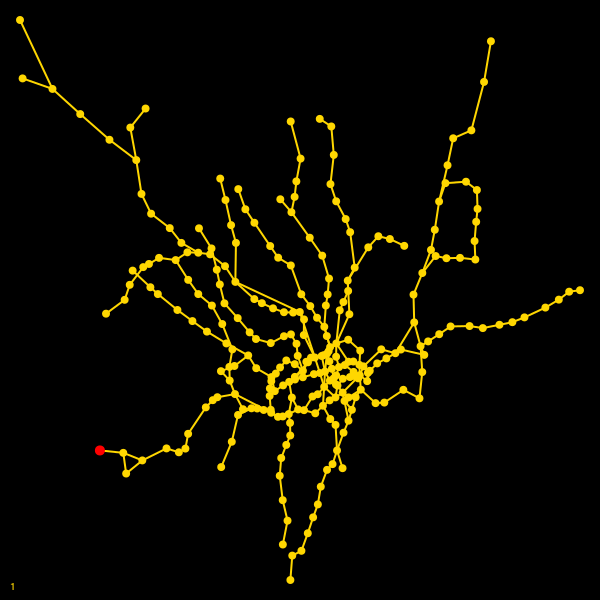

```@setup tubesection
using Karnak, Luxor, Graphs, NetworkLayout, Colors
using DataFrames, CSV

# positions are in LatLong

tubedata = CSV.File("../../examples/tubedata-modified.csv") |> DataFrame

amatrix = Matrix(tubedata[:, 4:270])

g = Graph(amatrix)

extrema_lat = extrema(tubedata.Latitude)
extrema_long = extrema(tubedata.Longitude)

# scale LatLong and flip in y to fit into current Luxor drawing
positions = @. Point(rescale(tubedata.Longitude, extrema_long..., -280, 280), rescale(tubedata.Latitude, extrema_lat..., 280, -280))

stations = tubedata[!,:Station]

find(str) = findfirst(isequal(str), stations)
find(x::Int64) = stations[x]
```

# Examples

## The London Tube

One real-world example of a small network is the London
Underground, known as "the Tube". The 250 or so stations in
the network can be modelled using a simple graph.

### Setup

If you want to follow along, this is the setup required. The
CSV file `examples/tubedata-modified.csv` contains the
station names, latitude and longitudes, and connectivity
details.

```julia
using Karnak, Luxor, Graphs, NetworkLayout, Colors
using DataFrames, CSV

# positions are in LatLong

tubedata = CSV.File("examples/tubedata-modified.csv") |> DataFrame

amatrix = Matrix(tubedata[:, 4:270])

extrema_lat = extrema(tubedata.Latitude)
extrema_long = extrema(tubedata.Longitude)

# scale LatLong and flip in y to fit into current Luxor drawing
positions = @. Point(
    rescale(tubedata.Longitude, extrema_long..., -280, 280),
    rescale(tubedata.Latitude, extrema_lat..., 280, -280))

stations = tubedata[!,:Station]

find(str) = findfirst(isequal(str), stations)
find(x::Int64) = stations[x]

g = Graph(amatrix)
```

The tube "map" is stored in `g`, as a `{267, 308} undirected simple Int64 graph`.

The `find()` functions are just a quick way to convert between station names and ID numbers:

```@example tubesection
find("Waterloo")
```

```@example tubesection
find(244)
```

## Not a map

Most London residents and visitors are used to seeing the famous [Tube Map](https://en.wikipedia.org/wiki/Tube_map):


It's a design classic, hand-drawn by Harry Beck in 1931, and updated regularly
ever since. As an electrical engineer, Beck represented the sprawling London
track network as a tidy circuit board. As with graphs, what was important to
Beck were the connections, rather than accurate geography.

Our version looks very different, but it is at least more accurate,
geographically, because the latitude and longitude values of the stations are
passed to `layout`.

```@example tubesection
@drawsvg begin
background("grey10")
sethue("grey50")
drawgraph(g,
    layout=positions,
    vertexshapes = :none,
    vertexlabeltextcolors = colorant"white",
    vertexlabels = find.(1:nv(g)),
    vertexlabelfontsizes = 6)
end
```

The algorithmic representations - `layout=spring` and `layout=stress` - do a reasonable job, but people like to see north at the top of maps, and south at the bottom, not mixed up in any direction, like these.

```@example tubesection
@drawsvg begin
background("grey20")
tiles = Tiler(800, 400, 1, 2)
sethue("white")

@layer begin
    translate(first(tiles[1]))
    drawgraph(g,
        layout=spring,
        boundingbox = BoundingBox(box(O, 400, 400)),
        vertexshapes = :none,
        vertexlabeltextcolors = colorant"white",
        vertexlabels = find.(1:nv(g)),
        vertexlabelfontsizes = 6
        )
end

@layer begin
    translate(first(tiles[2]))
    drawgraph(g,
        layout=stress,
        boundingbox = BoundingBox(box(O, 400, 400)),
        vertexshapes = :none,
        vertexlabeltextcolors = colorant"white",
        vertexlabels = find.(1:nv(g)),
        vertexlabelfontsizes = 6
        )
end

end 800 400
```

## Train terminates here

Use the `degree()` function to show just the station names at the end of a line: a vertex with a degree of 1 is a terminus:

```@example tubesection
@drawsvg begin
background("grey90")
sethue("black")
drawgraph(g, layout=positions,
    vertexshapesizes = 2,
    vertexlabels = (vtx) ->
        begin
            if degree(g, vtx) == 1
                text(find(vtx), positions[vtx])
            end
        end)
end
```

These labels show names familiar to all Tube-riders - the ones shown on the front of trains and on platform indicators. (It's unusual to visit them all, unless you're like [Geoff Marshall](https://www.bbc.co.uk/news/uk-england-london-24203949), who holds the world record for the fastest time visiting every Tube station.)

## Neighbors

The best connected station is also one of the oldest, dating back to 1863:

```@example tubesection
find(argmax(degree(g, 1:nv(g))))
```

Its neighbors are:

```@example tubesection
find.(neighbors(g, find("Baker Street")))
```
## Centrality

Using Graphs.jl's tools for measuring centrality, Baker Street is again at the top of the list, but Green Park (the Queen's nearest tube station), scores highly, despite not being in the top 20 busiest stations.

```@example tubesection
@drawsvg begin
background("grey10")
translate(0, -200)
scale(3)
bc = betweenness_centrality(g)
sethue("gold")
_, maxbc = extrema(bc)
drawgraph(g, layout = positions,
    vertexlabels = (vtx) -> bc[vtx] > maxbc * 0.6 && string(find(vtx)),
    vertexlabeltextcolors = colorant"cyan",
    vertexlabelfontsizes = 6,
    vertexshapesizes = 1 .+ 10bc,
    vertexfillcolors = HSB.(rescale.(bc, 0, maximum(bc), 0, 300), 0.7, 0.8),
    )
end 800 600
```

## Mornington Crescent

A route from Heathrow Terminal 5 to [Mornington Crescent](https://en.wikipedia.org/wiki/Mornington_Crescent_(game)) can be found using `a_star()`.

```@example tubesection
heathrow_to_morningtoncrescent = a_star(g,
    find("Heathrow Terminal 5"),
    find("Mornington Crescent"))

@drawsvg begin
background("grey70")
translate(0, -100)
scale(3)

sethue("grey50")
drawgraph(g,
    layout = positions,
    vertexshapesizes = 1)

sethue("black")
fontsize(4)
drawgraph(g,
    layout = positions,
    vertexshapes = :none,
    edgelist = heathrow_to_morningtoncrescent,
    edgestrokeweights = 3,
    vertexlabels = (vtx) -> begin
        if vtx ∈ src.(heathrow_to_morningtoncrescent) ||
           vtx ∈ dst.(heathrow_to_morningtoncrescent)
             circle(positions[vtx], 2, :fill)
             label(find(vtx), :e, positions[vtx])
        end
    end)
end
```

The route found by `a_star` is:

```@example tubesection
[find(dst(e)) for e in heathrow_to_morningtoncrescent]
```

Information about the required changes - at Victoria from
the Piccadilly line to the Victoria Line, and at Warren
Street from the Victoria Line to the Northern Line - is not
part of the graph. Routes across the Tube network, like the
trains, follow the tracks (edges) - the concept of "lines"
(Victoria, Circle, etc) isn't part of the graph structure,
but a colorful layer imposed on top of the track network.

## Diffusion

Graphs.jl provides many functions for analysing graph networks. The
`diffusion()` function appears to simulate the diffusion of an infection from
some starting vertices.

So here, apparently, is a simulation of what might happen when an infection
arrives at Heathrow Airport's Terminal 5 tube station, and starts spreading
through the tube network.

```julia
function frame(scene, framenumber, d)
    background("black")
    sethue("gold")
    text(string(framenumber), boxbottomleft() + (10, -10))
    drawgraph(g,
        layout = positions,
        vertexshapesizes = 3)
    for k in 1:framenumber
        i = d[k]
        drawgraph(g,
            layout = positions,
            edgelines = 0,
            vertexfunction = (v, c) -> begin
                if !isempty(i)
                    if v ∈ i
                        sethue("red")
                        circle(positions[v], 5, :fill)
                    end
                end
            end)
        end
    end

function main()
    amovie = Movie(600, 600, "diff")
    d = diffusion(g, 0.2, 200, initial_infections=[find("Heathrow Terminal 5")])
    animate(amovie,
        Scene(amovie, (s, f) -> frame(s, f, d), 1:length(d)),
        framerate=10,
        creategif=true,
        pathname="/tmp/diff.gif")
end
main()
```


